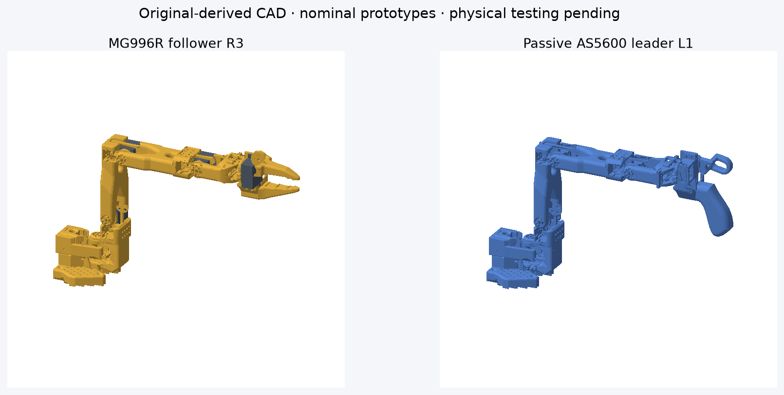
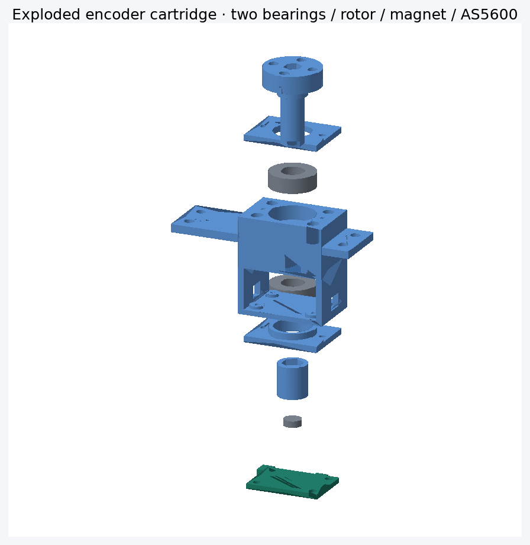
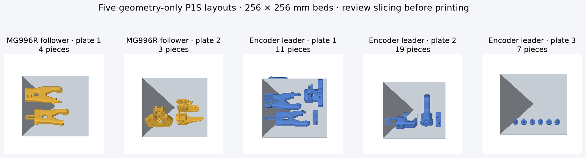

# Thenar Arms — SO-101 / MG996R + encoder leader

Original-derived SO-101 robot CAD, a six-MG996R follower, a passive six-AS5600
leader, browser assembly viewer, P1S print layouts and ESP32 prototype firmware.
**Engineering prototypes: not physically tested or payload rated.**



## Current deliverables

| Kit | Printed pieces | P1S geometry layouts | Guide |
|---|---:|---:|---|
| MG996R follower R3 | 7 | 2 | [BOM and assembly](so101-mg996r/R3-PRINT.md) |
| Passive AS5600 leader L1 | 37 (12 unique) | 3 | [BOM, dimensions, wiring and calibration](so101-mg996r/ENCODER-LEADER.md) |

- [Follower STL/3MF ZIP](so101-mg996r/output/follower-r3/SO101-MG996R-R3-PROTOTYPE.zip)
- [Encoder leader STL/3MF/firmware ZIP](so101-mg996r/output/encoder-leader-l1/SO101-AS5600-LEADER-L1.zip)
- [Encoder evidence](so101-mg996r/output/encoder-leader-l1/verification.json)

These are converted files, not the stock SO-101 plates. Keep revisions separate.
Leader needs six Adafruit6357 AS5600 boards, twelve 8×16×5 bearings, six diametric
6×2 magnets, ESP32 + TCA9548A and specified fasteners. Follower needs six MG996R
servos (four reported owned), matching metal-disc horns and ESP32 + PCA9685.
Full BOMs are in the linked guides. Only AS5600 board geometry is specified;
generic controller enclosures are not included.

## SolidWorks assemblies and release

The existing R3 follower and L1 leader have separate articulated SolidWorks
assemblies. Download the [SolidWorks reconstruction release](https://github.com/nickthelegend/thenar-arms/releases/tag/solidworks-r3-l1-2026-09-23)
for the native CAD files, validation evidence and simulation handoffs. Open the
[follower master](solidworks/assemblies/SO101_Follower_Master.SLDASM) or
[leader master](solidworks/assemblies/SO101_Leader_Master.SLDASM) with the
`solidworks/parts/` and `solidworks/hardware/` folders kept alongside them.
The [SolidWorks guide](solidworks/README.md) explains the saved poses and joint
controls; the [reconstruction report](docs/final_report.md) gives measured
geometry, motion and collision results.

| Assembly | Components | Moving joints | Native motion checks |
|---|---:|---:|---|
| MG996R follower R3 | 19 | 6, including jaw | 28/28 poses passed |
| Passive AS5600 leader L1 | 73 | 6, including trigger | 28/28 poses passed |

**Already printed parts:** the original STL/3MF files were not modified. A
hash check found all 330 original project files unchanged, so the SolidWorks
work does not call for reprinting them. The CAD reconstruction is not a
byte-identical STL copy: the largest sampled surface differences are
0.00196 mm for the follower and 0.00338 mm for the leader. One leader forearm
CAD solid has a documented 0.00001 mm internal separation needed for a valid
solid body. These are CAD/export differences; physical fit remains untested.

The ROS 2 description and MuJoCo kinematics pass the recorded pose checks.
ROS 2 visualization, Isaac import and physical dynamics have not been tested.
The release's ZIP contains all 593 files added for this reconstruction;
GitHub's source archive contains the complete repository at that release.




## Run the website

```sh
cd robot-studio
npm ci
npm run dev
```

Open [the assembly viewer](http://127.0.0.1:5173/) or
[print layouts](http://127.0.0.1:5173/?geometry=clearance&view=fit-test).
Keep the terminal running. The website displays actual exported meshes and never
connects to hardware. `?geometry=original` opens untouched upstream references.

## What is verified — and what is not

| Check | Result |
|---|---|
| Closed single-shell printing meshes | 7 follower + 12 unique leader meshes |
| Nominal mounting-interface checks | 6/6 follower; 6/6 leader |
| Sampled internal collisions | Follower72/72 clear; leader70/72 clear |
| Unsafe samples | Table intersections and two folded leader collisions retained in reports; preview rejects detected requested poses |
| Cartridge rotation / PCB insertion | No positive overlap in sampled checks; nominal 2 mm magnet gap |
| Print layout | Five layouts, 12 mm spacing, P1S envelope checked |
| Slicing release | **Not cleared**; clipping diagnostics/layer review unresolved, geometry downloads only |
| Firmware | Both ESP32 roles compile; host motion-math tests pass; follower locked until calibration |
| Physical validation | **Not performed**: bearing fits, screws/tools, sensors, wiring, strength and powered operation |

Print/test **one encoder cartridge first**, not all five plates. Closed STL
meshes and animations do not prove working hardware. Preview checks are discrete,
not a swept-path planner. No payload claim. Firmware STOP/OE is not a physical
power cut; support the arm against gravity and provide a hardware disconnect.

## Reproduce CAD and checks

Python3.12 recommended. Make a venv and install
[`so101-mg996r/requirements-cad.txt`](so101-mg996r/requirements-cad.txt).
Committed original-source meshes/manifest provide the input datums.

```sh
python so101-mg996r/tools/build_encoder_leader.py
python so101-mg996r/tools/verify_encoder_leader.py
python so101-mg996r/tools/pack_encoder_leader.py
# Optional macOS, installed Bambu Studio required:
python so101-mg996r/tools/slice_encoder_leader.py
python so101-mg996r/tools/publish_encoder_project.py
python so101-mg996r/tools/render_project.py
cd robot-studio
node scripts/verify-preview.mjs
node scripts/verify-r3.mjs
node scripts/verify-encoder.mjs
npm run build
```

The publisher refuses failed home/interface/hash checks. Generated layouts do
not ship runnable G-code. See the leader guide for both firmware compile commands,
calibration and opt-in serial bridge. No automatic flashing or arming occurs.

## Source and licensing

Original SO-101 source: [TheRobotStudio/SO-ARM100](https://github.com/TheRobotStudio/SO-ARM100),
Apache-2.0, licence preserved at `so101-mg996r/source/LICENSE`. Geometry is locally
modified, with original parts/datums retained; no whole-arm scaling.
AS5600 drawing: [Adafruit Industries](https://github.com/adafruit/Adafruit-AS5600-Magnetic-Angle-Sensor-PCB),
CC BY-SA, attribution/licence in `so101-mg996r/source/encoder/`.
Third-party assets retain their respective licences; this repository does not
claim to relicense them. Images above are renders of the actual exported CAD,
not photographs of a tested robot.
